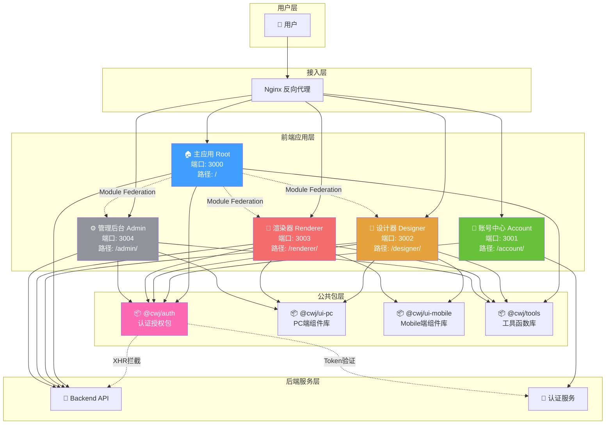
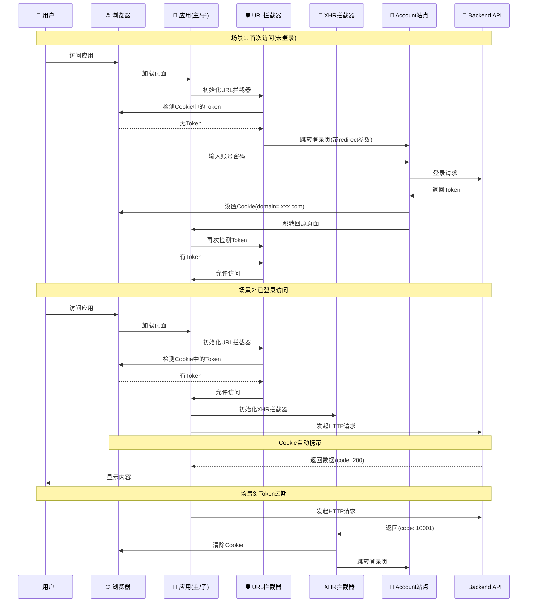
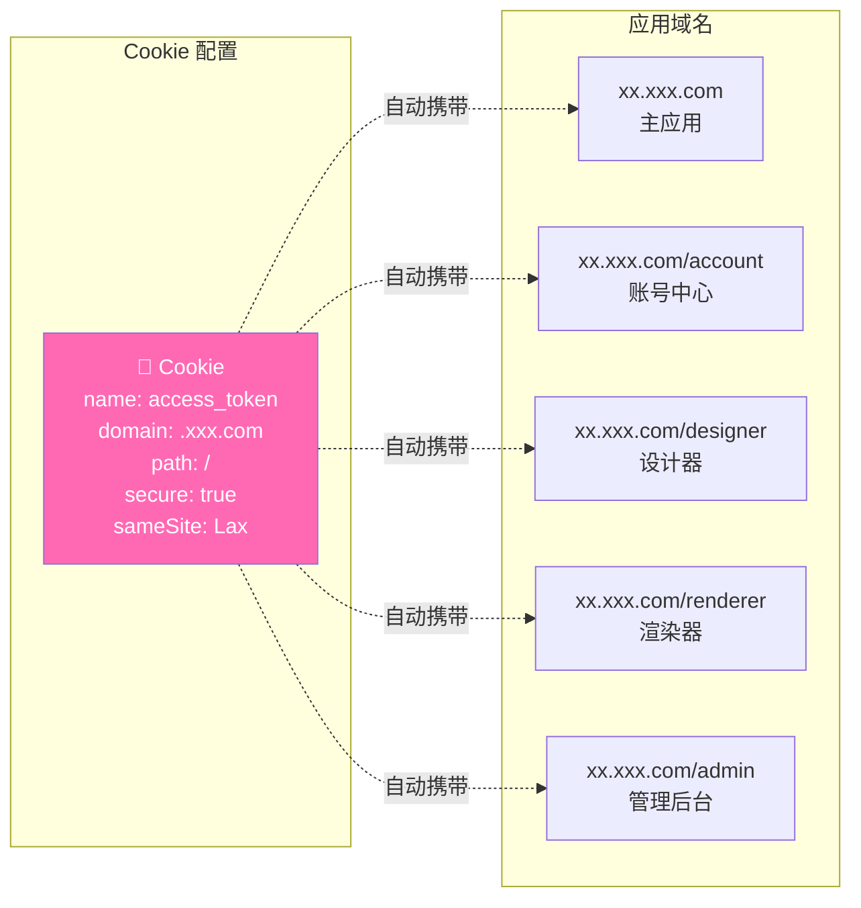
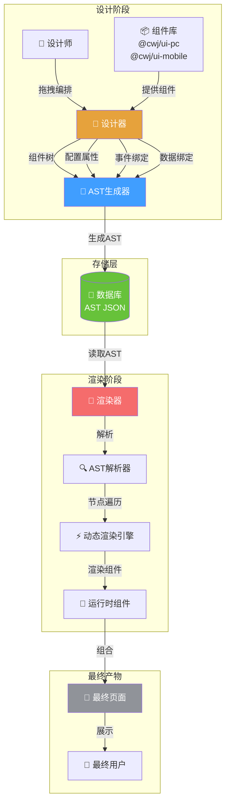

# 架构设计文档

## 📐 系统架构

### 微前端架构方案

- **技术**: Webpack5 Module Federation
- **模式**: 主应用(宿主) + 多个子应用(远程模块)
- **共享依赖**: Vue、Vue Router、Pinia 等核心库单例共享

### 整体架构图



### 应用间关系

**主应用(Root)** 作为宿主容器,通过 Module Federation 动态加载子应用:

```
主应用(Root)
    ├──> Account (账号中心) - 独立站点
    ├──> Designer (设计器) - 可嵌入/独立访问
    ├──> Renderer (渲染器) - 可嵌入/独立访问
    └──> Admin (管理后台) - 可嵌入/独立访问
```

## 📦 应用模块

### 主应用 (Root)

**职责**: 应用容器和路由管理

**功能**:

- 工作台首页
- 用户中心
- 操作日志
- 子应用加载和路由管理
- 全局状态管理和事件总线
- 集成 @cwj/auth 认证包

### Account (账号中心)

**职责**: 统一登录认证

**功能**:

- 统一登录页面(账号密码/验证码/扫码)
- 用户注册
- 密码找回
- 第三方登录集成(微信/钉钉/企业微信)
- OAuth 2.0 授权

**访问方式**:

- 独立站点: `https://xx.xxx.com/account/`
- 所有应用未登录时重定向到此站点

### Designer (设计器)

**职责**: 可视化页面设计

**功能**:

- 支持 PC 端和 Mobile 端设计
- 拖拽式组件编排
- 属性配置面板
- 实时预览
- AST 生成器(输出 AST 格式数据)
- 页面数据持久化

**产物输出**: AST(抽象语法树)格式

- 支持组件树结构
- 支持指令(v-if/v-for/v-show 等)
- 支持事件绑定和表达式
- 支持数据绑定和计算属性

**访问方式**:

- 独立访问: `https://xx.xxx.com/designer/`
- 嵌入模式: 主应用通过 Module Federation 加载

### Renderer (渲染器)

**职责**: 动态页面渲染

**数据源**: 设计器产出的 AST(抽象语法树)

**核心能力**:

- AST 解析引擎
- 动态组件渲染
- 指令系统(v-if/v-for/v-show/v-model)
- 事件系统(支持表达式和方法调用)
- 数据绑定(响应式数据、计算属性)
- 运行时沙箱环境(安全隔离)

**访问方式**:

- 独立访问: `https://xx.xxx.com/renderer/`
- 嵌入模式: 主应用通过 Module Federation 加载

### Admin (管理后台)

**职责**: 系统管理

**功能**:

- 应用管理
- 页面管理
- 用户权限管理
- 数据统计和监控

**访问方式**:

- 独立访问: `https://xx.xxx.com/admin/`
- 嵌入模式: 主应用通过 Module Federation 加载

## 📚 公共包

### @cwj/auth (认证授权包)

**职责**: 统一认证授权

**核心功能**:

- Token 管理(Cookie 存储,利用同源策略)
- Token 过期检测
- URL 拦截(页面加载时检测 Token)
- XHR 拦截(业务状态码 10001 处理)
- 权限判断函数
- Vue Router 守卫(可选)

**包类型**: npm 包,发布到私有 npm 仓库

### @cwj/ui-pc / @cwj/ui-mobile (UI 组件库)

**职责**: 统一 UI 组件

**技术方案**:

- @cwj/ui-pc: 基于 Element Plus 二次封装
- @cwj/ui-mobile: 基于 Vant 二次封装

**包类型**: npm 包,发布到私有 npm 仓库

### @cwj/tools (工具函数库)

**职责**: 通用工具函数

**功能**:

- 通用工具函数(日期、字符串、数组等)
- 业务工具函数(数据转换、格式化等)
- 类型定义(TypeScript)

**包类型**: npm 包,发布到私有 npm 仓库

## 🔄 应用通信

### 1. Module Federation 加载

```typescript
// 主应用 - 动态加载子应用组件
import { defineAsyncComponent } from 'vue'

const DesignerApp = defineAsyncComponent(() => import('designer/App'))
const RendererApp = defineAsyncComponent(() => import('renderer/App'))
const AdminApp = defineAsyncComponent(() => import('admin/App'))
```

### 2. 全局事件总线

```typescript
// 全局事件总线(跨应用通信)
import mitt from 'mitt'

export const eventBus = mitt()

// 主应用 - 发送事件
eventBus.emit('user:login', { userId: 123 })

// 子应用 - 监听事件
eventBus.on('user:login', data => {
  console.log('用户登录:', data)
})
```

### 3. 共享状态 (Pinia Store)

```typescript
// 主应用 - 创建共享 Store
import { defineStore } from 'pinia'

export const useGlobalStore = defineStore('global', {
  state: () => ({
    userInfo: null,
    token: '',
  }),
})

// 子应用 - 使用共享 Store
import { useGlobalStore } from '@/store/global'

const globalStore = useGlobalStore()
console.log(globalStore.userInfo)
```

### 4. Cookie 共享 (认证 Token)

```typescript
// Cookie 配置
domain: '.xxx.com' // 支持所有子域名

// 支持的域名:
// ✅ xx.xxx.com (主应用)
// ✅ xx.xxx.com/designer (设计器)
// ✅ xx.xxx.com/renderer (渲染器)
// ✅ xx.xxx.com/admin (管理后台)
// ✅ xx.xxx.com/account (账号中心)

// Cookie 自动共享,所有子路径自动获取 Token
```

## 🔐 认证授权架构

### 认证流程架构图



### 双重拦截机制

```
页面加载
    ↓
URL 拦截器(检测 Cookie 中的 Token)
    ↓ 无 Token
跳转 account 登录
    ↓ 有 Token
正常加载页面
    ↓
发起 HTTP 请求
    ↓
XHR 拦截器(检测业务状态码)
    ↓ code: 10001
清除 Cookie + 跳转 account 登录
```

### Cookie 同源策略



**Cookie 配置说明:**

- **存储**: Token 存储在 Cookie 中
- **域名**: domain=.xxx.com
- **自动携带**: 浏览器自动在同源请求中携带 Cookie
- **跨应用共享**: 所有子应用自动共享 Token
- **安全选项**: secure, sameSite=Lax

## 📊 数据流

### 设计器 → 渲染器数据流图



### 数据流说明

```
设计器(Designer)
    ↓ 拖拽编排
    ↓ 配置属性
    ↓
[AST 生成器]
    ↓
AST 数据(JSON)
    ↓ 保存到数据库
    ↓
渲染器(Renderer)
    ↓ AST 解析
    ↓ 动态渲染
    ↓
最终页面
```

### AST 格式示例

```javascript
{
  "type": "Page",
  "id": "page_001",
  "children": [
    {
      "type": "div",
      "props": {
        "class": "container"
      },
      "directives": [
        {
          "name": "if",
          "value": "userInfo.isLogin"
        }
      ],
      "children": [
        {
          "type": "Button",
          "props": {
            "type": "primary"
          },
          "events": {
            "click": "handleSubmit"
          },
          "children": "提交"
        }
      ]
    }
  ],
  "data": {
    "userInfo": {
      "isLogin": true
    }
  },
  "methods": {
    "handleSubmit": "function() { console.log('submit') }"
  }
}
```

## 🎯 技术选型理由

### Webpack5 Module Federation

**选择理由**:

- ✅ 原生支持微前端
- ✅ 运行时动态加载
- ✅ 依赖共享机制完善
- ✅ 与现有 Webpack 生态兼容

### Vue 3 + TypeScript

**选择理由**:

- ✅ Composition API 更灵活
- ✅ 性能更优
- ✅ TypeScript 支持完善
- ✅ 生态成熟

### Pinia

**选择理由**:

- ✅ Vue 3 官方推荐
- ✅ TypeScript 支持更好
- ✅ API 更简洁
- ✅ 支持 Composition API

### Cookie 存储 Token

**选择理由**:

- ✅ 浏览器自动携带
- ✅ 支持子域名共享
- ✅ 无需手动管理请求头
- ✅ 更符合 Web 标准
- ✅ 支持 HttpOnly(防 XSS)

### AST 渲染方案

**选择理由**:

- ✅ 表达能力强(支持复杂逻辑)
- ✅ 接近原生(可表达 Vue 所有特性)
- ✅ 可扩展性好
- ✅ 安全性高(沙箱隔离)

## 🔧 扩展性设计

### 1. 组件扩展

设计器和渲染器支持自定义组件扩展

### 2. 插件机制

各应用支持插件化扩展

### 3. 主题定制

UI 组件库支持主题定制

### 4. 国际化

支持多语言切换

## 📈 性能优化

### 1. 代码分割

- 路由级代码分割
- 组件级按需加载
- 第三方库按需引入

### 2. 缓存策略

- Webpack 持久化缓存
- HTTP 缓存策略
- Service Worker(可选)

### 3. 资源优化

- 图片压缩和懒加载
- CSS 提取和压缩
- Tree Shaking

### 4. 运行时优化

- 虚拟列表
- 防抖节流
- 计算属性缓存

## 🔒 安全性设计

### 1. XSS 防护

- Cookie HttpOnly
- 内容安全策略(CSP)
- 输入验证和转义

### 2. CSRF 防护

- Cookie SameSite
- Token 验证

### 3. 沙箱隔离

- 渲染器运行时沙箱
- 限制危险操作

### 4. 权限控制

- 路由级权限
- 按钮级权限
- 接口级权限
